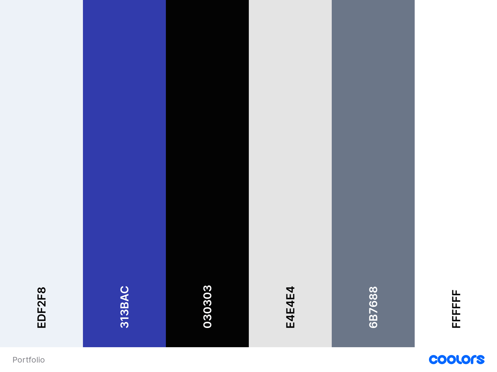

# This is my portfolio built with React as the frontend and Sanity as the backend.

## Table of Contents

- [User Experience (UX)](#user-experience-ux)
  - [Design](#design)
    - [Wireframes](#wireframes)
    - [Color Scheme](#color-scheme)
    - [Typography](#typography)
- [Features](#features)
  - [Home Page](#home-page)
  - [Navigation](#navigation)
- [Testing](#testing)
  - [Bugs](#bugs)
    - [Fixed Bugs](#fixed-bugs)
    - [Remaining Bugs](#remaining-bugs)
- [Technologies Used](#technologies-used)
  - [Languages and Frameworks Used](#languages-and-frameworks-used)
  - [Node Packages / Dependencies Used](#node-packages--dependencies-used)
  - [Programs and Tools Used](#programs-and-tools-used)
- [Deployment](#deployment)
  - [Forking the GitHub Repository](#forking-the-github-repository)
  - [Making a Local Clone](#making-a-local-clone)
  - [Deploying with Heroku](#deploying-with-heroku)
- [Credits](#credits)
  - [Acknowledgments](#acknowledgments)

[React](https://reactjs.org/)

[Sanity v3](https://www.sanity.io/) - backend

## User Experience UX

### Design
### Wireframes
### Color-scheme

### Typography

## Features

### Home Page
### Navigation

## Testing

### Bugs
### Fixed Bugs

Populating it here but it is an array so I have to loop over all of my experiences as well, because the objects in this array represent years.
Every single year can have multiple experiences.
Instead of immediately loopig over experience that works, first loop over only over the experience.
So different years can be showed and nested map instead.

### Remaining Bugs

Tooltip in skills bug on mobile view

## Technologies Used

### Languages and Frameworks Used
### Node Packages / Dependencies Used
- sanity/client
- sanity/image-url
- framer-motion
- node-sass
- react-icons
- react-toolkit

### Programs and Tools Used
https://www.devbridge.com/articles/implementing-clean-css-bem-method/
https://www.framer.com/motion
https://www.canva.com/
https://reactjs.org/docs/higher-order-components.html

## Deployment

### Forking the gitHub Repository
### Making a Local Clone
### Deploying with Hostinger

## Credits
### Acknowledgments

